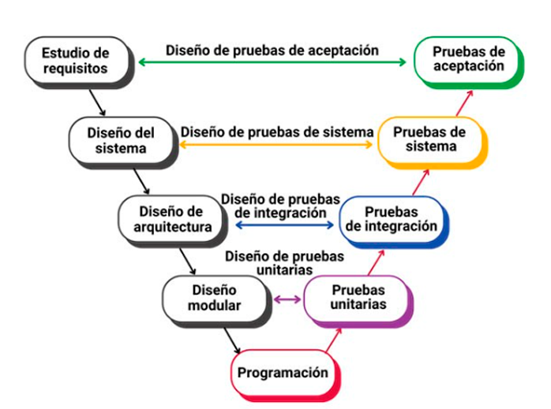

### Tipos de Pruebas

Las pruebas de software se dividen en diferentes tipos, cada una enfocada en un aspecto específico del sistema: 
1. **Pruebas Unitarias**: Verifican componentes individuales, como funciones o métodos.
2. **Pruebas de Integración**: Se enfocan en cómo interactúan los distintos módulos del sistema
3. **Pruebas del Sistema**: Aseguran que todo el sistema funcione correctamente en conjunto.
4. **Pruebas de Aceptación**: Validan que el sistema cumpla con los requisitos del cliente.

Este proceso de pruebas se integra en el Modelo en V, un enfoque que relaciona la verificación y la validación con cada fase del desarrollo del software.

    

### Herramientas de pruebas en Python

Las herramientas de pruebas en Python son fundamentales para asegurar la calidad del código y facilitar el proceso de desarrollo mediante la automatización de las pruebas. Estas herramientas permiten verificar el comportamiento esperado de los componentes de un sistema de manera eficiente y estructurada. En Python, existen diversas opciones que se adaptan a diferentes necesidades y niveles de complejidad. Entre las más destacadas se encuentran:

- **Unittest**: Es la biblioteca estándar para pruebas unitarias en Python. Proporciona un marco estructurado para escribir y ejecutar pruebas, permitiendo verificar el comportamiento de componentes individuales en el código. Es ideal para pruebas simples y se integra fácilmente en proyectos de Python. Aquí tenemos un ejemplo de unittest:
- **PyTest**: Un framework popular y más flexible que Unittest, diseñado para hacer las pruebas más robustas. Ofrece características avanzadas como fixtures y una sintaxis más simple, lo que lo convierte en una opción preferida para proyectos más grandes y complejos.

- **Nose**: Extiende las funcionalidades de Unittest, añadiendo características adicionales que facilitan la ejecución de pruebas, como la detección automática de pruebas y un mejor manejo de errores. Aunque menos popular que PyTest, sigue siendo útil para proyectos más pequeños o donde se necesite una integración sencilla con Unittest.

Despúes tenemos las **Técnicas de prueba** que son enfoques que se utilizan para realizar pruebas de software y garantizar que el sistema funcione correctamente. Existen diversas técnicas, entre las cuales se destacan:

### Caja Negra

En las pruebas de caja negra, el tester no tiene acceso ni conocimiento sobre la estructura interna del sistema. El enfoque se centra exclusivamente en las entradas y salidas del sistema. Se verifica si el sistema cumple con los requisitos y expectativas, pero sin analizar cómo se procesan internamente los datos.

**Objetivo**: Asegurar que el sistema funcione como se espera desde la perspectiva del usuario o cliente.

**Técnicas comunes**:
- **Particiones de equivalencia**: Dividir los datos de entrada en grupos (particiones) que se espera que se manejen de manera similar.
- **Análisis de valores límite**: Verificar el comportamiento del sistema con los valores más bajos, altos y cercanos a los límites especificados.

### Caja Blanca

En las pruebas de caja blanca, el tester tiene acceso completo al código fuente y a la lógica interna del sistema. Estas pruebas se centran en verificar que el sistema esté implementado correctamente, asegurando que el código funcione de acuerdo con lo que está especificado.

**Objetivo**: Asegurar que el código y la lógica del sistema sean correctos, probando el flujo de control, las estructuras de datos y los algoritmos internos.

**Técnicas comunes**:
- **Cobertura de sentencias**: Asegurarse de que cada línea de código sea ejecutada al menos una vez durante las pruebas.
- **Cobertura de decisiones**: Verificar que todas las decisiones (condiciones o bucles) en el código sean evaluadas tanto a verdadero como a falso.
- **Cobertura de caminos**: Asegurarse de que todos los caminos posibles del código sean probados al menos una vez.

### Comparación
- **Caja Negra**: Se enfoca en la funcionalidad externa sin conocer el código interno. Es útil para probar que el sistema cumple con los requisitos y expectativas del cliente.
- **Caja Blanca**: Se enfoca en la lógica interna del sistema, probando que el código esté escrito correctamente. Es útil para detectar errores en el código y verificar su calidad interna.

Ambas técnicas son complementarias, y se pueden usar juntas para lograr una cobertura completa del sistema durante las pruebas.

