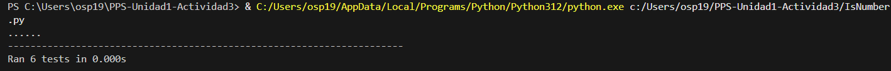
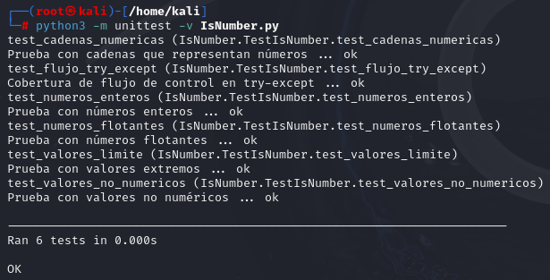

<div style="text-align: justify;">

# Pruebas de Software: Caja Negra y Caja Blanca

En las pruebas de software, vamos a utilizar distintos enfoques para evaluar la funcionalidad y robustez del código. A continuación, presentamos las dos estrategias comunes que hemos visto en clase: **Caja Negra**, que se enfoca en la entrada y salida sin conocer la implementación interna, y **Caja Blanca**, que analiza el flujo interno del código.

Y las pruebas las vamos a aplicar a la funcion [**IsNumber**](IsNumber.py)

````
import unittest

# 5. Función para verificar si un valor es un número
def isNumber(valor):
    """
    Función que verifica si el argumento 'valor' es un número.
    """
    try:
        float(valor)  # Intentamos convertir a float
        return True
    except ValueError:
        return False

class TestIsNumber(unittest.TestCase):

    # Pruebas de caja negra
    def test_numeros_enteros(self):
        """ Prueba con números enteros """
        self.assertTrue(isNumber(5))
        self.assertTrue(isNumber(-10))
        self.assertTrue(isNumber(0))

    def test_numeros_flotantes(self):
        """ Prueba con números flotantes """
        self.assertTrue(isNumber(3.14))
        self.assertTrue(isNumber(-2.71))
        self.assertTrue(isNumber(0.0))

    def test_cadenas_numericas(self):
        """ Prueba con cadenas que representan números """
        self.assertTrue(isNumber("123"))
        self.assertTrue(isNumber("-456.78"))
        self.assertTrue(isNumber("0"))

    def test_valores_no_numericos(self):
        """ Prueba con valores no numéricos """
        self.assertFalse(isNumber("abc"))
        self.assertFalse(isNumber("123abc"))


    def test_valores_limite(self):
        """ Prueba con valores extremos """
        self.assertTrue(isNumber(float("inf")))
        self.assertTrue(isNumber(float("-inf")))
        self.assertTrue(isNumber("inf"))  # Algunas implementaciones permiten "inf" como string
        self.assertTrue(isNumber("-inf"))
        self.assertTrue(isNumber("NaN"))  # Aunque "NaN" es técnicamente un número, su uso es especial

    # Pruebas de caja blanca
    def test_flujo_try_except(self):
        """ Cobertura de flujo de control en try-except """
        with self.assertRaises(TypeError):  # float() no acepta None
            float(None)

        with self.assertRaises(ValueError):  # float() no convierte "abc"
            float("abc")

if __name__ == "__main__":
    unittest.main()
````
## Ejecución del fichero de pruebas

Ejecutamos el fichero de pruebas creado:

<p>
    
</p>

O si estuviéramos en **Kali-Linux** ejecutaríamos el comando:

````
python3 -m unittest -v IsNumber.py
`````
Y tendríamos el resultado:

<p>
    
</p>


</div>